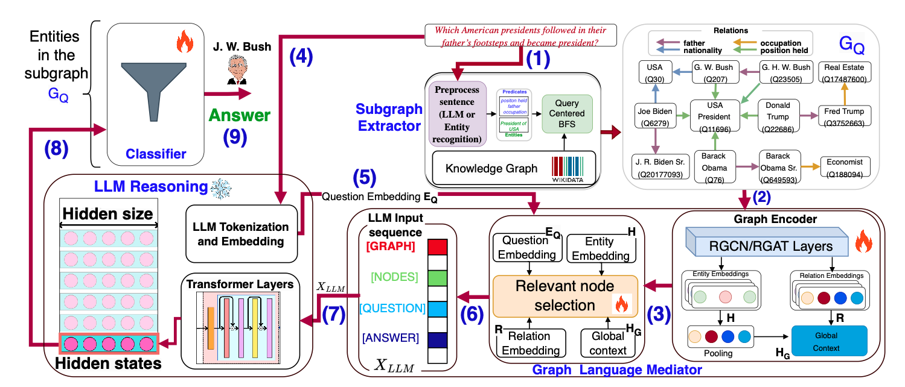

# GRALAN: The Graph Language

[](https://iswc2025.semanticweb.org/)
[](#)
[](LICENSE)

> **Enabling Knowledge Graphs to "speak" directly in the LLM's semantic space through relational tokens**



## Overview

Large Language Models (LLMs) excel at reasoning but benefit from grounding provided by Knowledge Graphs (KGs), although integrating these two knowledge representation paradigms is challenging. We introduce **GraLan (The Graph Language)**, which enables KGs to "speak" directly in the LLM's semantic space through **relational tokens**—learned representations that preserve the KG structure and semantics. 

GraLan uses a trainable **graph language mediator** to generate relational tokens that are fed into a frozen LLM for diverse downstream tasks. We tested GraLan in a question-answering scenario, where we reframe it as entity classification over the nodes of a question-focused subgraph. Experiments demonstrate that GraLan outperforms existing methods.

## 🎯 Key Features

- **🗣️ Graph Language**: Enables KGs to "speak" directly in LLM's semantic space
- **🔗 Relational Tokens**: Learned representations preserving KG structure and semantics  
- **🚀 Frozen LLM Integration**: No fine-tuning required for the language model
- **📈 Entity Classification**: Reframes QA as classification over question-focused subgraphs
- **🎯 Trainable Mediator**: Graph language mediator bridges symbolic and neural representations

## 🏗️ Architecture

GraLan's implementation consists of several key components:

### 1. **Question-Focused Subgraph Extraction** (`ExtractRelevantSubGraph.py`)
- Extracts relevant subgraphs centered around question entities
- Maintains structural relationships essential for reasoning
- Reduces computational complexity while preserving semantic information

### 2. **Knowledge Graph Construction** (`GraphBuilder.py`)
- Constructs and manages knowledge graph representations
- Handles graph data structures and relationships
- Prepares graph data for the language mediator

### 3. **Question and Data Processing** 
- **Parser** (`Parser.py`): Processes questions and extracts relevant information
- **QuestionDataset** (`QuestionDataset.py`): Manages QA datasets and batching
- **PredicateRelatednessMatrix** (`PredicateRelatednessMatrix.py`): Computes predicate relationships and semantic connections

### 4. **Graph Language Mediator Integration** (`main.py`)
- **Trainable Component**: Learns to generate relational tokens from KG structure
- **Semantic Preservation**: Maintains KG semantics in learned representations
- **LLM Compatibility**: Generates tokens compatible with frozen LLM's semantic space
- **Entity Classification**: Reframes QA over subgraph nodes

## 🔄 How It Works

```
Question → Subgraph Extraction → Graph Language Mediator → Relational Tokens → Frozen LLM → Entity Classification
```

1. **Extract** question-focused subgraph from knowledge graph
2. **Generate** relational tokens through trainable graph language mediator
3. **Preserve** KG structure and semantics in learned representations
4. **Integrate** with frozen LLM using generated relational tokens
5. **Classify** entities to answer questions over the subgraph


## 🚀 Quick Start

```bash
# Clone the repository
git clone https://github.com/giuseppepirro/gralan.git
cd gralan

# Install dependencies
pip install -r requirements.txt

# Run the main script
python main.py --question "Which American presidents followed in their father's footsteps?" --kg wikidata

# Or with custom parameters
python main.py --help  # See available options
```

## 📁 Project Structure

```
gralan/
├── main.py                           # Main execution script
├── ExtractRelevantSubGraph.py        # Subgraph extraction from knowledge graph
├── GraphBuilder.py                   # Knowledge graph construction utilities
├── Parser.py                         # Data parsing functionality
├── PredicateRelatednessMatrix.py     # Predicate relationship computations
├── QuestionDataset.py                # Dataset handling for QA tasks
├── architecture.png                  # Architecture diagram
├── README.md                         # Project documentation
├── README.txt                        # Additional documentation
└── requirements.txt                  # Dependencies (if present)
```

## 🎯 Use Cases

- **Knowledge Graph Question Answering**: Direct reasoning over KG structures with LLMs
- **Graph-Grounded Language Tasks**: Tasks requiring both structural and semantic understanding
- **Zero-Shot KG Integration**: Leveraging frozen LLMs with new knowledge graphs
- **Semantic Graph Analysis**: Understanding complex relationships in knowledge graphs
- **Multi-Modal Knowledge Fusion**: Combining structured and unstructured knowledge

## 📖 Citation

If you use GRALAN in your research, please cite our ISWC 2025 paper:

```bibtex
@inproceedings{pirro2025gralan,
  title={The Graph Language: How Knowledge Graphs Speak to Large Language Models},
  author={Pirrò, Giuseppe and others},
  booktitle={Proceedings of the International Semantic Web Conference (ISWC)},
  pages={TBD},
  year={2025},
  organization={Springer}
}
```

## 🤝 Contributing

We welcome contributions! Please see [CONTRIBUTING.md](CONTRIBUTING.md) for guidelines.

## 📄 License

This project is licensed under the MIT License - see the [LICENSE](LICENSE) file for details.

## 🙏 Acknowledgments

- Built on PyTorch and Transformers library
- Evaluated on standard KG-QA benchmarks including Wikidata and ConceptNet
- Research conducted at Sapienza University of Rome, Department of Computer Science
- Giuseppe Pirro is an expert in Semantic Web, Knowledge Graphs, and Graph Databases
- Code for: "The Graph Language: Enabling Knowledge Graphs to Speak in LLM's Semantic Space"

---

**📧 Contact**: Giuseppe Pirro (giuseppe.pirro@uniroma1.it)  
**🌐 Repository**: [https://github.com/giuseppepirro/gralan](https://github.com/giuseppepirro/gralan)  
**📑 Paper**: [ISWC 2025 - Coming Soon]
